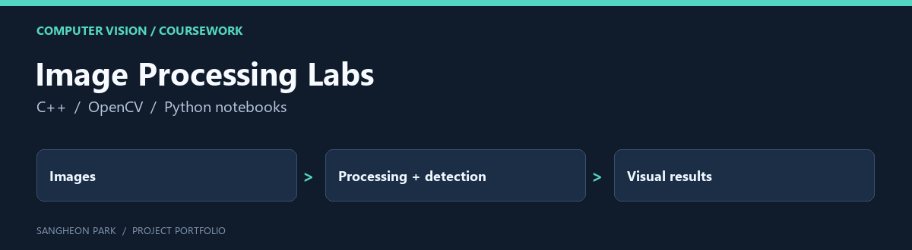

# Image Processing Labs

A course archive of image-processing assignments, tutorials and image assets, with lane-detection work as a concrete entry point.

[Portfolio home](https://github.com/oldprize47-SH) · [Original repository](https://github.com/oldprize47/DLIP_2025)

## Contribution and context

This is my coursework archive, including course-provided scaffolding and supporting material. The entire tree is not original research or solely authored production code. The final GazeMouse project has its own focused portfolio fork.

## Code map

| Entry | Purpose |
|---|---|
| [Assignment/Assignment_Line_Detection/DLIP_Assignment_21800275_SangheonPark.cpp](Assignment/Assignment_Line_Detection/DLIP_Assignment_21800275_SangheonPark.cpp) | Lane-detection assignment |
| [Assignment/Assignment_Line_Detection/Lane_center.jpg](Assignment/Assignment_Line_Detection/Lane_center.jpg) | Recorded lane-centre example |
| [Include/TU_DLIP.cpp](Include/TU_DLIP.cpp) | Course image-processing helpers |
| [Props/opencv-4.11.0_release_x64.props](Props/opencv-4.11.0_release_x64.props) | Historical Windows OpenCV build settings |

## Visual example

## Start here

Read the lane-detection source beside its recorded output, then inspect the
course helper functions. The `.props` files record an OpenCV 4.11 Windows setup;
local library paths must be adapted to a new machine.

This is a preserved teaching archive rather than a clean one-command package.
No full rebuild or fresh image-processing benchmark was performed in this pass.
See the [GazeMouse project](https://github.com/oldprize47-SH/gaze-mouse-course-project)
for the separate end-to-end application.

## Archive policy

The fork retains upstream history, source attributions and course material. The
portfolio documentation does not assign a new licence or claim sole authorship
of inherited code. Current checks are stated above; an untested component is not
presented as verified.
