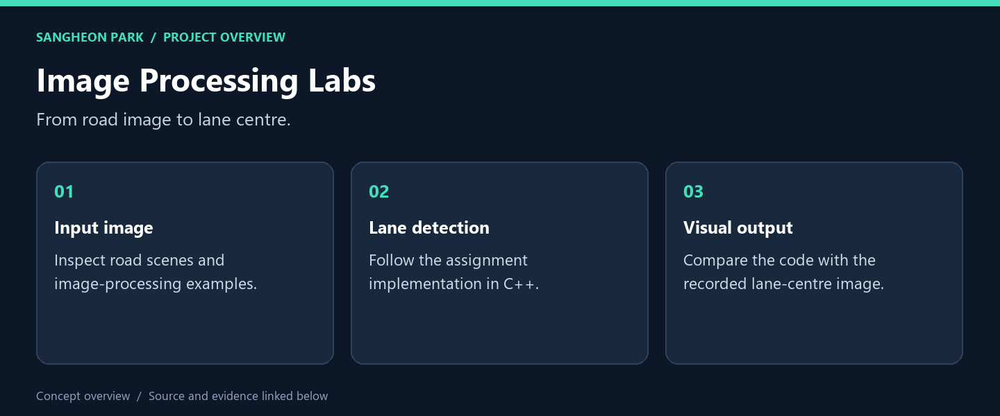
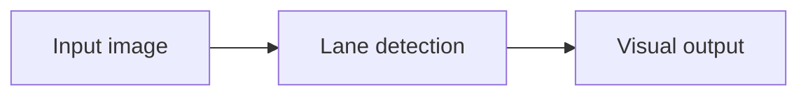

# Image Processing Labs

**OpenCV coursework connecting image-processing code with visible output, led by a lane-detection assignment.**

[What I built](#what-i-built) · [My role](#my-role) · [Code and reproduction](#code-and-reproduction) · [Portfolio](https://github.com/oldprize47-SH)

## What I built

| Deliverable | What it does | Explore |
|---|---|---|
| **Lane detector** | Main assignment implementation | [Source / result](Assignment/Assignment_Line_Detection/DLIP_Assignment_21800275_SangheonPark.cpp) |
| **Recorded result** | Lane-centre output from the archive | [Source / result](Assignment/Assignment_Line_Detection/Lane_center.jpg) |
| **Course helpers** | Supporting image-processing routines | [Source / result](Include/TU_DLIP.cpp) |

### Result at a glance

Recorded output is included below. No fresh full rebuild or detection benchmark was run.

## My role

This is my coursework archive, including course-provided scaffolding and supporting material. The entire tree is not original research or solely authored production code. The final GazeMouse project has its own focused portfolio fork.

## How it works

## Code and reproduction

## Visual example

## Start here

Read the lane-detection source beside its recorded output, then inspect the
course helper functions. The `.props` files record an OpenCV 4.11 Windows setup;
local library paths must be adapted to a new machine.

This is a preserved teaching archive rather than a clean one-command package.
No full rebuild or fresh image-processing benchmark was performed in this pass.
See the [GazeMouse project](https://github.com/oldprize47-SH/gaze-mouse-course-project)
for the separate end-to-end application.

## Source and credits

[Original repository](https://github.com/oldprize47/DLIP_2025) · [Portfolio home](https://github.com/oldprize47-SH)

Course scaffolding, team contributions and third-party assets retain their original attribution. This documentation does not grant a new licence.
