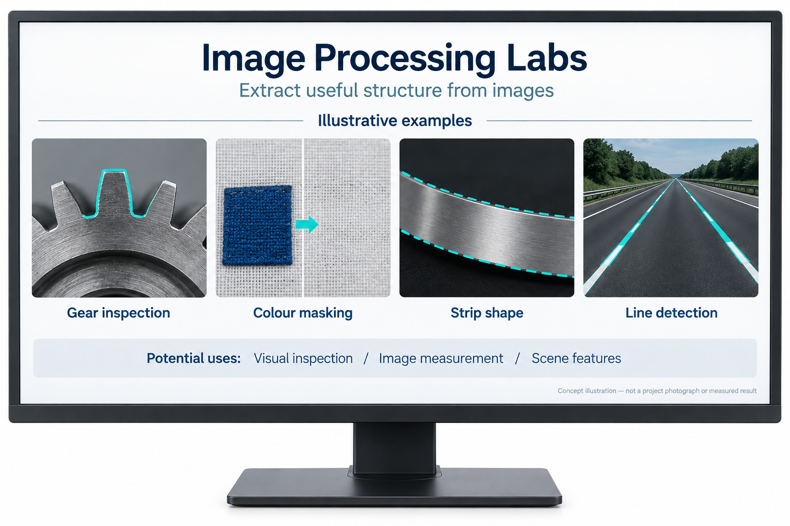
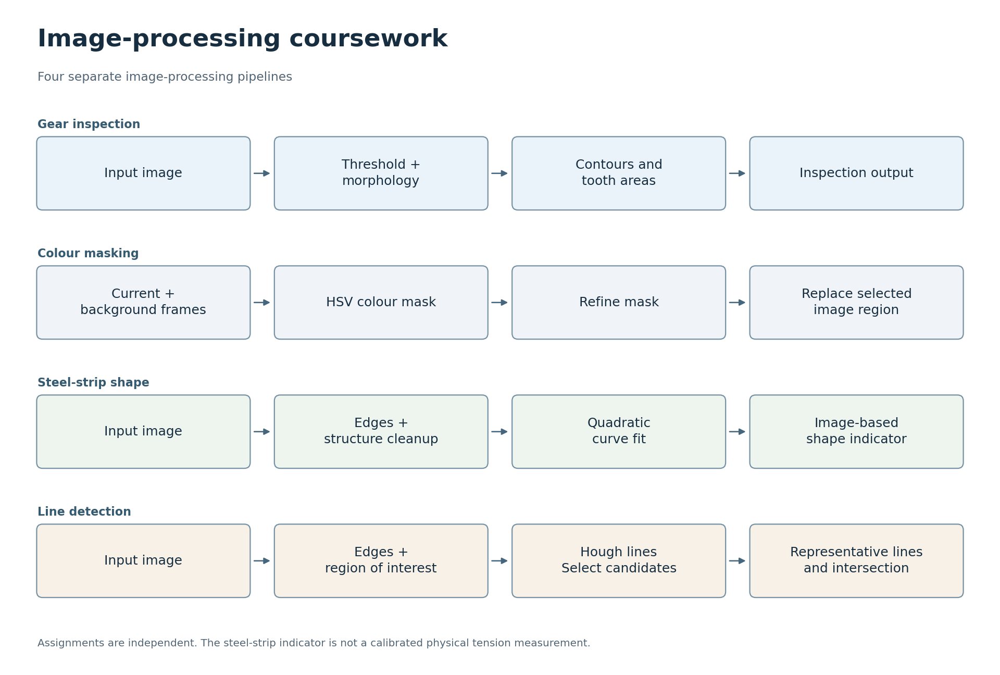

# 영상처리

[한국어](#korean) · [English](#english)

## 한국어

이 자료에는 2025년 영상처리 수업의 과제와 실습이 담겨 있습니다. C++/OpenCV 프로그램, 노트북, 테스트 이미지, 수업에서 제공한 보조 코드가 포함되어 있습니다.

차선 검출 과제는 그중 한 예입니다. 프로그램은 도로 영상을 처리하고 차선 중심을 표시합니다. 소스는 [차선 검출 과제](Assignment/Assignment_Line_Detection/DLIP_Assignment_21800275_SangheonPark.cpp)에 있습니다.

[기어 검출 실습](LAB/DLIP_LAB1/DLIP_LAB1_21800275_SangheonPark.cpp)과 [강판 형상 실습](LAB/DLIP_LAB3/DLIP_LAB3_21800275_SangheonPark_image.py)의 로컬 버전을 2026년 9월 28일 반영했습니다. Python 파일은 구문 검사를 통과했으며, 새로운 영상처리 벤치마크는 수행하지 않았습니다.

### 프로젝트 목표

영상에서 기어의 기하학적 형상, 색상 영역, 강판 형상, 도로 차선 후보 등 유용한 구조를 추출합니다.

AI로 생성한 개념도입니다. 장치의 외형, 인터페이스 배치, 예시 그래픽은 설명을 위한 표현이며, 실제 프로젝트 사진이나 측정 결과가 아닙니다.

### 활용할 수 있는 곳

기어와 강판 실습은 외관 검사 및 영상 기반 형상 분석 작업과 연결됩니다. 색상 마스킹과 선 추출은 장면에서 유용한 특징을 분리하는 작은 사례입니다. 이 실습들을 실제 검사 환경으로 옮기려면 대표성 있는 이미지와 통제된 촬영 환경이 필요하며, 물리량을 측정하려면 보정도 필요합니다. 도로 영상 실습은 영상처리를 시연하는 것으로, 검증된 차량 주행 시스템은 아닙니다.

### 한눈에 보기

각 행은 독립적인 실습이나 처리 흐름을 설명합니다. 하나로 연결된 애플리케이션이 아닌 개별 실습 모음이므로, 관심 있는 행부터 살펴볼 수 있습니다. [SVG](docs/flowcharts/image-labs.svg)

### 각 과제의 동작

링크된 과제는 박상헌의 수업 과제입니다. 수업에서 제공한 기본 코드와 보조 코드는 원래의 저작자 표기를 유지합니다.

[기어 검사 실습](LAB/DLIP_LAB1/DLIP_LAB1_21800275_SangheonPark.cpp)은 임계값 처리, 형태학적 연산, 윤곽선을 사용하여 기어 이를 분리하고 비정상적인 이 영역을 찾아냅니다. 눈에 보이는 결함을 영상에서 측정할 수 있는 기하학적 특징과 연결하는 실습입니다. 저장된 예시는 이 처리 과정을 살펴보는 데 사용할 수 있습니다. 다만 모든 기어 형상이나 조명 조건을 다룬 벤치마크는 아닙니다.

[색상 마스킹 실습](LAB/DLIP_LAB2/DLIP_LAB2_21800275_SangheonPark_sample1.cpp)은 투명 망토 효과를 만듭니다. HSV 공간에서 색상 범위를 선택하고, 마스크를 다듬은 뒤, 현재 프레임의 선택 영역을 배경 이미지로 대체합니다. 조명과 전경·배경 색상의 구분 정도가 결과에 영향을 줍니다.

[강판 형상 실습](LAB/DLIP_LAB3/DLIP_LAB3_21800275_SangheonPark_image.py)은 영상에서 에지를 추출하고 불필요한 구조를 억제한 뒤, 남은 경계점에 이차 곡선을 피팅합니다. 영상 안에서 곡선이 놓인 위치로부터 표시할 수준 값을 산출합니다. 이 값을 읽을 때는 영상 안의 위치에서 얻은 점수로 이해하면 됩니다. 실제 장력이나 응력을 보정하여 측정한 값은 아닙니다.

차선 과제는 Canny 에지, 관심 영역, Hough 직선을 사용해 좌우 차선 후보를 선택합니다. 대표 직선을 구성하고 교점을 구하여 소실점과 주행 영역을 표시합니다. 보고서의 예시는 정지 영상이며, 차량 제어 시스템이나 전체 주행 영상에 걸친 안정적인 검출을 입증하지는 않습니다.

### 실습을 읽고 재현하는 방법

차선 과제는 소스와 아래의 원본 입력 예시를 함께 보면 이해하기 쉽습니다. 입력을 확인한 뒤 에지 추출, 직선 선택, 최종 오버레이 순서로 읽을 수 있습니다. 다른 실습도 각 실습 폴더의 파일과 영상처리 단계를 나란히 살펴보면 흐름을 파악하는 데 도움이 됩니다. 원래 과제와의 연결을 유지하기 위해 파일 이름과 수업 보조 코드를 보존했습니다.

여러 실습을 개별 Windows 프로젝트로 개발했기 때문에, 하나의 패키지로 설치하는 방식은 제공하지 않습니다. 실행을 준비할 때는 각 파일의 입력 이미지 경로, 작업 디렉터리, 출력 위치부터 확인하면 됩니다. Python 실습에는 코드에서 가져오는 수치 계산·영상처리 패키지가 필요하고, C++ 실습에는 선택한 컴파일러에 맞게 OpenCV 헤더와 라이브러리를 설정해야 합니다.

### 빌드

[OpenCV 속성 시트](Props/opencv-4.11.0_release_x64.props)에 원래의 Windows/OpenCV 4.11 설정이 기록되어 있습니다. 다른 컴퓨터에서 빌드하려면 사용 환경에 맞게 라이브러리 경로를 조정해야 합니다. 이번 문서 업데이트에는 전체 재빌드가 포함되지 않았습니다.

[Include/TU_DLIP.cpp](Include/TU_DLIP.cpp)에는 수업 보조 함수가 들어 있습니다. 저장소에는 학생 과제뿐 아니라 제공받은 수업 자료도 포함되어 있으며, 해당 소스의 원래 저작자 표기를 유지합니다.

최종 [시선 추적 마우스 프로젝트](https://github.com/oldprize47-SH/GazeMouse)는 별도로 문서화되어 있습니다.

[원본 저장소](https://github.com/oldprize47/DLIP_2025). 원래의 이력과 저작자 표기를 유지합니다.

### 원본 입력 예시

차선 검출이 어떤 입력에서 시작하는지 살펴볼 수 있는 과제 이미지입니다. 검출 결과나 새 벤치마크 실행 결과를 보여 주는 이미지는 아닙니다.

---

## English

**Image Processing Labs**

This archive contains assignments and exercises from the 2025 image-processing course. They include C++/OpenCV programs, notebooks, test images and course-provided helper code.

The lane-detection assignment is one example. The program processes a road image and marks the lane centre. Its source is in [the lane-detection assignment](Assignment/Assignment_Line_Detection/DLIP_Assignment_21800275_SangheonPark.cpp).

The local versions of the [gear-detection lab](LAB/DLIP_LAB1/DLIP_LAB1_21800275_SangheonPark.cpp) and [steel-strip shape lab](LAB/DLIP_LAB3/DLIP_LAB3_21800275_SangheonPark_image.py) were incorporated on 28 September 2026. The Python file passed a syntax check; no new image-processing benchmark was run.

### Project goal

Extract useful structure from images: gear geometry, colour regions, strip shape and road-line candidates.

AI-generated concept illustration. Device appearance, interface layout and example graphics are illustrative, not project photographs or measured results.

### Where it could be used

The gear and strip exercises connect to visual-inspection and image-based shape-analysis tasks. Colour masking and line extraction provide smaller examples of separating useful features from a scene. Moving these exercises to a real inspection setup would require representative images, controlled acquisition and, for physical measurements, calibration. The road-image exercise demonstrates image processing rather than a validated vehicle-driving system.

### At a glance

Each row describes an independent exercise or workflow. Since this is a collection of separate exercises rather than one connected application, you can start with the row that interests you. [SVG](docs/flowcharts/image-labs.svg)

### What the assignments do

The linked assignments are Sangheon Park's coursework. Course-provided scaffolding and helper code retain their original attribution.

The [gear inspection lab](LAB/DLIP_LAB1/DLIP_LAB1_21800275_SangheonPark.cpp) uses thresholding, morphology and contours to separate the gear teeth and identify unusual tooth areas. The exercise connects a visible defect with a geometric feature that can be measured in the image. The saved examples offer a way to explore that process, but they are not a benchmark across all gear shapes or lighting conditions.

The [colour-masking lab](LAB/DLIP_LAB2/DLIP_LAB2_21800275_SangheonPark_sample1.cpp) creates an invisibility-cloak effect. It selects a colour range in HSV space, refines the mask and replaces the selected part of the current frame with a background image. Lighting and the separation between foreground and background colours affect the result.

The [steel-strip shape lab](LAB/DLIP_LAB3/DLIP_LAB3_21800275_SangheonPark_image.py) extracts edges from an image, suppresses unwanted structure and fits a quadratic curve to the remaining boundary points. It derives a displayed level from the curve's position in the image. The displayed level is best read as an image-based score. It is not a calibrated measurement of physical tension or stress.

The lane assignment uses Canny edges, a region of interest and Hough lines to select left and right lane candidates. It forms representative lines and solves for their intersection to show a vanishing point and driving region. The report's examples are still images; this does not demonstrate a vehicle-control system or stable detection over a complete driving video.

### Reading and reproducing an exercise

For the lane assignment, it helps to read the source alongside the original input example below. From the input, you can follow edge extraction, line selection and the final overlay. The other labs can be explored in the same way, matching each processing stage to the files in its lab folder. The filenames and course helper code are retained to keep the connection with the original assignments.

Several exercises were developed as individual Windows projects rather than as one installable package. To prepare an exercise for your environment, start by checking its input-image path, working directory and output locations. Python exercises need their imported numerical/image-processing packages; C++ exercises need the OpenCV headers and libraries configured for the chosen compiler.

### Building

The [OpenCV property sheet](Props/opencv-4.11.0_release_x64.props) records the original Windows/OpenCV 4.11 setup. To build on another machine, the library paths need to match that environment. This documentation update did not include a full rebuild.

[Include/TU_DLIP.cpp](Include/TU_DLIP.cpp) contains course helper functions. The repository includes supplied teaching material as well as student coursework; those sources keep their original attribution.

The final [Gaze Tracking Mouse project](https://github.com/oldprize47-SH/GazeMouse) is documented separately.

[Original repository](https://github.com/oldprize47/DLIP_2025). Original history and attribution are retained.

### Original input example

This assignment image shows the input used for lane detection. It is not a detected-lane result or the output of a new benchmark run.

